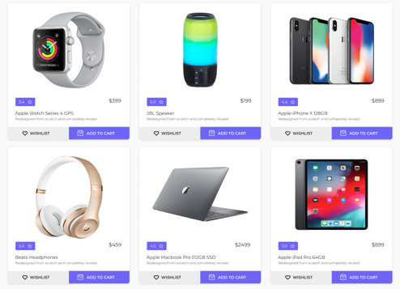

# CardsList

Необхідно реалізувати CardsList компонент, 
який буде відповідати за відображення списку карточок товарів.

Можете використовувати або flex, або grid.
Звертайте увагу на розміри карточок та відстані між ними.
